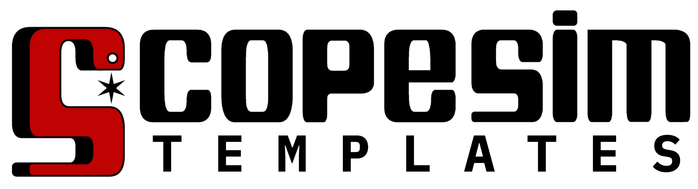

|

|logo| Another tool from the `A* Vienna software team <https://astarvienna.github.io/>`_

.. |logo| image:: https://raw.githubusercontent.com/AstarVienna/astarvienna.github.io/main/logos/star_small_t.png
   :height: 30px
   :align: middle

A library of templates and helper functions for creating
:class:`scopesim.source.source.Source` objects that can be used to run `ScopeSim` simulations.

In short :class:`scopesim.source.source.Source` objects contain a description of the spatial and
spectral information of the source. For more information see :ref:`here <Source Object>`.

Installation
------------

This package has been released on PyPi::

   pip install scopesim_templates

.. toctree::
    :maxdepth: 2
    :caption: Contents:
    contributions
    source_object
    reference
   

From basic to advanced helper functions
---------------------------------------
ScopeSim Templates is a python package, and is therefore by nature infinitely extendable.

As it is impossible for us to know all the details about your specific science case, we provide a
small selection of basic objects (star cluster, elliptical galaxy, etc).
Feel free to start with these to get started with ScopeSim.

However if your needs outgrow the basic objects, we encourage you to extended the objects to fit your
specific science case. In this case **we strongly encourage you to get in contact with us adding your code
in the form of a subpackage**. You can do this either by opening an issue on Github, or by emailing one of the developers.

Available subpackages
---------------------

Documentation for all the helper functions contained in each package can be found in the API documentation for each package.

* ``stellar``:
   * :func:`star`
   * :func:`stars`
   * :func:`cluster`
   * :func:`stars_field`
   * :func:`star_grid`

* ``extragalactic``
   * :func:`spiral_two_component`
   * :func:`elliptical`
* ``misc``
    * :func:`empty_sky`
    * :func:`point_source`
    * :func:`source_from_image_hdu`
    * :func:`source_from_imagehdu_with_flux`

Contact
-------
If you find an issue with ScopeSim Templates, please let us know via the `Github issues page <https://github.com/AstarVienna/ScopeSim_Templates/issues>`_

